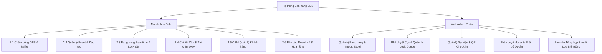

# TÀI LIỆU ĐẶC TẢ YÊU CẦU HỆ THỐNG (SOFTWARE REQUIREMENTS SPECIFICATION - SRS)
## HỆ THỐNG QUẢN LÝ BÁN HÀNG BẤT ĐỘNG SẢN & BẢNG HÀNG REAL-TIME (PROPTECH SALES SUITE)
**Đơn vị phát triển / Ứng dụng:** BĐS (Bất động sản)  
**Phiên bản:** 1.0.0 | **Ngày ban hành:** 2026-09-09  
**Nền tảng mục tiêu:** Mobile App (iOS / Android - React Native/Flutter) & Web Admin Portal (React / Next.js)

---

## 1. TỔNG QUAN HỆ THỐNG & ĐỐI TƯỢNG SỬ DỤNG

### 1.1. Bối cảnh & Mục tiêu dự án
Trong ngành môi giới và phân phối bất động sản, tốc độ và tính chính xác của thông tin bảng hàng quyết định tỷ lệ chốt deal. Các sàn giao dịch truyền thống thường gặp phải các vấn đề:
- **Lệch thông tin bảng hàng:** Nhiều Sale cùng chốt 1 căn cùng lúc dẫn đến xung đột, khiếu nại (Double Booking).
- **Thiếu tính toán tài chính tức thời:** Khách hàng cần biết ngay tổng thanh toán gồm VAT, phí bảo trì và lịch trả góp ngân hàng hàng tháng, nếu Sale tính tay sẽ mất cơ hội vàng.
- **Chấm công phân tán:** Đội ngũ Sale làm việc tại văn phòng, nhà mẫu dự án, sự kiện mở bán... khó kiểm soát bằng máy chấm công vân tay thông thường.
- **Rò rỉ dữ liệu khách hàng & tài liệu dự án:** Cần kiểm soát phân quyền dự án và chia sẻ tài liệu có Watermark định danh Sale.

**Mục tiêu chính:**
1. Cung cấp nền tảng **Mobile App chuyên dụng cho Sale / CTV** giúp: Chấm công GPS + Selfie, truy cập Bảng hàng real-time, khóa căn tức thì, tính toán tài chính tự động, quản lý phễu CRM và đăng ký sự kiện.
2. Cung cấp **Web Admin Portal cho Quản lý & Back-office** giúp: Quản lý dự án/tòa/căn, duyệt lệnh giữ chỗ, kiểm soát biến động giá/trạng thái qua Audit Log, import/export Excel hàng ngàn căn và thống kê KPI doanh số.

---

### 1.2. Đối tượng sử dụng & Ma trận Phân quyền (RBAC)

| Vai trò (Role) | Thiết bị chính | Quyền hạn & Trách nhiệm |
| :--- | :--- | :--- |
| **Sale / Cộng tác viên (CTV)** | Mobile App (iOS/Android) | - Chấm công GPS + Selfie theo tọa độ sàn / dự án.<br>- Xem bảng hàng các dự án được cấp quyền.<br>- Tạo lệnh giữ chỗ (Hold căn) với thời gian chờ (TTL 15-30 phút).<br>- Tra cứu chi tiết căn, tính giá đầy đủ (VAT + KPBT), lập bảng tính vay ngân hàng.<br>- Tạo và chia sẻ file báo giá có Watermark qua Zalo/WhatsApp.<br>- Quản lý phễu khách hàng cá nhân (CRM Leads).<br>- Đăng ký tham dự Event mở bán / Training. |
| **Trưởng nhóm (Team Leader - TL)** | Mobile App & Web Admin | - Toàn bộ quyền của Sale.<br>- Theo dõi bảng chấm công, báo cáo đi muộn/vắng mặt của nhân sự trong nhóm.<br>- Duyệt lệnh giữ căn cấp 1 (nếu dự án yêu cầu phê duyệt quản lý).<br>- Theo dõi pipeline khách hàng và doanh số tổng của toàn nhóm. |
| **Admin / Back-office** | Web Admin Portal (PC/Tablet) | - Quản trị toàn bộ Dự án, Tòa, Tầng, Căn hộ, Bảng giá, Chính sách bán hàng.<br>- Quản trị trạng thái căn: Đang bán (Available), Đã nhận cọc (Holding), Đã bán (Sold), Tạm khóa (Locked).<br>- Phê duyệt cọc chính thức, giải phóng căn hết hạn giữ chỗ.<br>- Import/Export dữ liệu bảng hàng qua Excel.<br>- Quản lý danh sách nhân sự, phân quyền dự án theo team.<br>- Quản lý sự kiện, điểm danh khách tham gia qua mã QR.<br>- Xem Audit Log chi tiết lịch sử thay đổi từng căn hộ. |

---

## 2. ĐẶC TẢ CHI TIẾT TÍNH NĂNG CỐT LÕI (CORE MODULES)



---

### 2.1. Phân hệ Chấm công Sale (Attendance & Geofencing)

#### Luồng nghiệp vụ:
1. Sale mở tab **Chấm công** trên Mobile App.
2. Ứng dụng tự động lấy tọa độ GPS của thiết bị (`latitude`, `longitude`, `accuracy`).
3. Hệ thống đối chiếu tọa độ thiết bị với danh sách tọa độ hợp lệ đã cấu hình cho Sale (Văn phòng BĐS, Nhà mẫu dự án, Địa điểm Roadshow/Event).
4. **Kiểm tra bán kính (Geofencing):** Khoảng cách tính bằng công thức Haversine phải `<= R_configured` (mặc định: 100 mét). Nếu ngoài vùng, hiển thị cảnh báo đỏ và khóa nút bấm.
5. **Chụp ảnh Selfie xác thực:** Bật camera trước, bắt buộc chụp ảnh khuôn mặt thực tế tại hiện trường (chống Fake GPS / giả lập ảnh thư viện).
6. Nhấn **Check-in** (buổi sáng) hoặc **Check-out** (kết thúc ca). Hệ thống lưu vết: `User_ID`, `Timestamp`, `GPS`, `Image_URL`, `Device_ID`, `Location_Name`, `Status` (Đúng giờ / Đi muộn).

#### Báo cáo & Xuất dữ liệu:
- Xem lịch sử chấm công cá nhân theo dạng Lịch (Calendar View) và Bảng (List View): Xanh lá (Hợp lệ), Vàng (Đi muộn/Về sớm), Đỏ (Vắng mặt).
- Team Leader có màn hình theo dõi quân số nhóm đi làm trong ngày (Real-time Headcount).
- Nút xuất dữ liệu định dạng Excel/CSV phục vụ tính lương và ghi nhận ngày công hoa hồng.

---

### 2.2. Phân hệ Quản lý Sự kiện (Event Hub)

#### Chức năng:
- **Danh mục sự kiện:** Phân loại rõ: *Lễ Mở Bán (Open Sale)*, *Roadshow Dự Án*, *Workshop Đào Tạo CTV*, *Lễ Tri Ân Khách Hàng*.
- **Thông tin chi tiết:** Tên sự kiện, Dự án liên quan, Thời gian bắt đầu - kết thúc, Địa điểm/Google Maps link, Số lượng slot tối đa, Số lượng đã đăng ký.
- **Đăng ký tham gia:** Sale nhấn đăng ký 1 chạm. Hệ thống sinh mã **QR Code Vé tham dự** cá nhân hóa.
- **Điểm danh tại chỗ:** Admin/Lễ tân dùng Mobile App hoặc máy quét QR để check-in tức thì cho Sale và khách đi cùng.
- **Push Notification:** Bắn thông báo nhắc nhở trước sự kiện (24h, 2h), thông báo thay đổi địa điểm/thời gian.

---

### 2.3. Phân hệ Quản lý Bảng hàng Real-time (Inventory Matrix)

Bảng hàng là linh hồn của hệ thống, đòi hỏi tốc độ cập nhật tức thời và khả năng hiển thị trực quan.

#### Cấu trúc hiển thị:
- **Bộ lọc đa tầng:** Lọc theo Dự án -> Tòa nhà (Tower) -> Phân khu -> Khoảng tầng (Tầng thấp 2-10, Tầng trung 11-25, Tầng cao 26-45).
- **Bộ lọc thuộc tính căn:** 
  - Số phòng ngủ: Studio, 1PN, 2PN, 3PN, Penthouse, Duplex.
  - Hướng ban công / Hướng cửa: Đông, Tây, Nam, Bắc, Đông Nam, Đông Bắc, Tây Nam, Tây Bắc.
  - Khoảng giá bán (từ ... tỷ đến ... tỷ).
  - Khoảng diện tích thông thủy (từ ... m² đến ... m²).
  - Trạng thái căn.
- **Giao diện Ma trận Tầng x Căn (Matrix Grid):** Hiển thị trực quan theo dạng lưới ô vuông đại diện cho từng căn hộ trên mặt bằng tầng. Mỗi ô hiển thị: `Mã căn` (ví dụ: `CH-1208`), `Loại PN`, `Diện tích`, `Giá rút gọn` (ví dụ: `4.52 Tỷ`).

#### 4 Trạng thái Cốt lõi & Mã màu chuẩn:

| Trạng thái | Mã định danh | Mã màu Hex | Ý nghĩa & Quy tắc |
| :--- | :--- | :--- | :--- |
| **Đang bán (Available)** | `AVAILABLE` | `#10B981` (Xanh lá) | Căn tự do, bất kỳ Sale nào cũng có thể tư vấn và yêu cầu giữ chỗ. |
| **Đang giữ chỗ (Holding)** | `HOLDING` | `#F59E0B` (Vàng hổ phách) | Đang được một Sale giữ trong khoảng thời gian có hạn (TTL 15-30 phút) để làm việc với khách. |
| **Đã bán (Sold)** | `SOLD` | `#EF4444` (Đỏ) | Đã vào tiền cọc chính thức hoặc ký Thỏa thuận đặt cọc / Hợp đồng mua bán. Không thể tác động. |
| **Tạm khóa (Locked)** | `LOCKED` | `#8B5CF6` (Tím nhạt) | Căn ngoại giao, căn giữ lại của Chủ đầu tư hoặc khóa kiểm tra dữ liệu từ Admin. |

#### Cơ chế Real-time & Chống xung đột (Anti-Double Booking):
- **Giao thức:** Sử dụng **WebSocket (Socket.io)** hoặc **Server-Sent Events (SSE)**.
- Khi có bất kỳ thay đổi nào từ Admin hoặc Sale khác (giữ căn, nhả căn, đổi giá), server phát tín hiệu `inventory:status_updated` tới toàn bộ client đang mở màn hình đó trong vòng `< 500ms`.
- **Cơ chế Khóa phân tán (Distributed Locking with Redis):**
  - Khi Sale A bấm "Yêu cầu Giữ Căn", backend gửi lệnh Redis `SET lock:unit:{id} {sale_id} NX EX 900` (giữ 15 phút).
  - Nếu thành công: Trạng thái căn đổi thành `HOLDING`, client của Sale A hiện đồng hồ đếm ngược `14:59`, các máy Sale khác lập tức chuyển căn sang màu Vàng và bị vô hiệu hóa nút đặt chỗ.
  - Khi hết 15 phút mà không có xác nhận cọc/tải phiếu thu từ Admin/TL, Redis Key hết hạn (`expired`), server tự động nhả căn về `AVAILABLE` và bắn socket broadcast tới toàn sàn.

---

### 2.4. Phân hệ Thông tin Chi tiết Căn & Tính toán Tài chính Toàn diện

Khi bấm vào một căn hộ bất kỳ, ứng dụng mở màn hình chi tiết gồm 4 khối thông tin:

#### Khối 1: Thông số Kỹ thuật Căn hộ
- Mã căn, Tầng, Tòa, Phân khu, Dự án.
- Diện tích thông thủy (Net Area) & Diện tích tim tường (Gross Area).
- Số phòng ngủ, Số phòng vệ sinh, Hướng ban công, Hướng cửa chính.
- Tầm view (ví dụ: View Hồ Tây, View công viên nội khu, View sông Hồng).
- Ảnh mặt bằng căn hộ (Floor plan) kèm tính năng phóng to / thu nhỏ tương tác.

#### Khối 2: Bóc tách Chi phí & Tổng Giá trị Thanh toán
Hệ thống tự động tính toán minh bạch theo công thức:
$$\text{Giá Net (Sau CK)} = \text{Giá Niêm Yết} - \text{Chiết khấu chính sách} - \text{Chiết khấu thanh toán sớm}$$
$$\text{Thuế VAT (10\%)} = (\text{Giá Net} - \text{Tiền sử dụng đất được giảm trừ}) \times 10\%$$
$$\text{Kinh phí bảo trì (KPBT 2\%)} = \text{Giá Net} \times 2\%$$
$$\textbf{Tổng thanh toán} = \text{Giá Net} + \text{Thuế VAT} + \text{Kinh phí bảo trì} + \text{Phí quản lý/dịch vụ}$$

#### Khối 3: Bảng Tiến độ Thanh toán Chuẩn
Hiển thị danh sách các đợt thanh toán (ví dụ: Đặt cọc 100 triệu, Đợt 1 ký HĐMB 15%, Đợt 2 đến Đợt 6 mỗi đợt 5-10%, Đợt nhận nhà 25% + 2% KPBT, Đợt cấp sổ hồng 5%). Mỗi đợt tự tính số tiền VNĐ tương ứng.

#### Khối 4: Công cụ Tính Lãi vay Trả góp Ngân hàng (Loan Calculator)
- Nhập/Kéo thanh trượt:
  - Tỷ lệ vay (% giá trị căn hộ: 50%, 65%, 70%, 80%).
  - Thời gian vay: từ 5 năm đến 35 năm (tối đa 420 tháng).
  - Lãi suất ưu đãi năm đầu (%/năm) & Lãi suất thả nổi các năm sau (%/năm).
  - Ân hạn nợ gốc (nếu có: 12 tháng, 24 tháng hoặc 0 tháng).
- Kết quả hiển thị tức thì:
  - Số tiền vay ngân hàng (VNĐ) & Vốn tự có cần chuẩn bị (VNĐ).
  - Số tiền trả tháng đầu tiên (gốc + lãi).
  - Lịch trả nợ chi tiết từng tháng theo phương pháp Dư nợ giảm dần hoặc Niên kim cố định.

#### Khối 5: Xuất Báo giá Chia sẻ Zalo/WhatsApp có Watermark
- Sale bấm "Xuất Báo Giá": Hệ thống tổng hợp toàn bộ thông tin căn + bảng giá chi tiết + số điện thoại/họ tên của chính Sale đó thành ảnh hoặc file PDF.
- Tự động đóng dấu **Watermark mờ** (Họ tên Sale, Mã nhân viên, Ngày giờ xuất, Hotline) để bảo vệ quyền tác giả thông tin và chống việc đối thủ lấy tài liệu xáo giá.

---

### 2.5. Phân hệ CRM Quản lý Khách hàng & Phễu Chăm sóc

#### Luồng quản lý Lead:
- **Thêm mới khách hàng:** Nhập Tên, SĐT, Nhu cầu (Dự án quan tâm, ngân sách, số phòng ngủ, mục đích mua: để ở hay đầu tư).
- **Phễu bán hàng (Kanban Pipeline):**
  1. `Mới (New Lead)` -> 2. `Đang tư vấn (Contacted/Consulting)` -> 3. `Hẹn xem nhà mẫu (Viewing)` -> 4. `Đã giữ chỗ (Holding)` -> 5. `Đã cọc (Deposited)` -> 6. `Ký HĐMB thành công (Won)` -> `Thất bại (Lost)`.
- **Lịch sử tương tác:** Ghi chú nội bộ sau mỗi cuộc gọi, tin nhắn Zalo hoặc gặp trực tiếp.
- **Nhắc việc thông minh (Task Reminders):** Cài đặt hẹn ngày giờ gọi lại cho khách; hệ thống gửi Push Notification nhắc nhở vào đầu ngày.

---

### 2.6. Phân hệ Báo cáo Doanh số, Hoa hồng & Xếp hạng (KPI & Leaderboard)

- **Báo cáo cá nhân:** Tổng doanh số luỹ kế tháng/quý/năm, số lượng căn đã chốt, tỷ lệ chuyển đổi từ lead sang cọc.
- **Ước tính hoa hồng:** Tính toán tự động số tiền hoa hồng thực nhận sau khi trừ thuế TNCN và các chi phí sàn.
- **Bảng vinh danh (Sales Leaderboard):** Xếp hạng Top 10 Best Sellers tuần/tháng/dự án giúp tạo động lực thi đua cạnh tranh lành mạnh.

---

### 2.7. Phân hệ Web Admin Portal (Dành cho Quản trị viên & Back-office)

#### 1. Quản lý Bảng hàng Tập trung
- Xem toàn bộ ma trận căn hộ của tất cả dự án trên màn hình lớn.
- Thao tác nhanh: Thay đổi trạng thái căn hàng loạt, cập nhật giá mới, áp dụng chính sách chiết khấu ngày hội mở bán.
- **Tính năng Import / Export Excel chuyên dụng:**
  - Tải file Excel mẫu chuẩn (gồm các cột: `Mã căn`, `Tòa`, `Tầng`, `Diện tích TT`, `Diện tích Tim`, `Số PN`, `Số WC`, `Hướng`, `Giá niêm yết`, `VAT`, `KPBT`).
  - Kéo thả file Excel để cập nhật 1.000+ căn hộ trong vài giây với cơ chế Validate dữ liệu tự động (báo lỗi dòng sai format).
  - Xuất file Excel hiện trạng bảng hàng real-time theo từng thời điểm.

#### 2. Hàng đợi Duyệt Cọc & Quản trị Lệnh Giữ chỗ (Booking Approval Queue)
- Danh sách các căn đang ở trạng thái `HOLDING`.
- Hiển thị tên Sale yêu cầu, khách hàng, thời gian giữ còn lại.
- Nút tác vụ: **Duyệt Cọc Chính Thức (Chuyển sang SOLD)** hoặc **Hủy lệnh giữ chỗ (Hoàn trả về AVAILABLE)** ngay lập tức.

#### 3. Nhật ký Biến động (Audit Trail / Activity Log)
- Lưu trữ mọi thao tác can thiệp vào bảng hàng:
  - *Thời gian:* `2026-09-09 14:32:10`
  - *Người thực hiện:* `Nguyễn Văn A (Admin)` hoặc `Trần Thị B (Sale)`
  - *Đối tượng:* `Căn S2-1508 - Dự án Starlake`
  - *Hành động:* `Thay đổi trạng thái từ AVAILABLE -> HOLDING (Thời gian giữ: 15 phút)`
  - *IP & Thiết bị:* `14.248.82.11 - iPhone 16 Pro Max`
- Giúp minh bạch 100%, giải quyết triệt để tranh chấp căn giữa các đội nhóm kinh doanh.

#### 4. Quản lý Sự kiện & Nhân sự
- Đăng tải sự kiện mở bán, cài đặt giới hạn số lượng tham dự.
- Phân bổ danh sách dự án cho từng Team (ví dụ: Team 1 phụ trách Dự án Tây Hồ, Team 2 phụ trách Dự án Nam Từ Liêm).

---

## 3. KIẾN TRÚC KỸ THUẬT & MÔ HÌNH HẠ TẦNG

```
                  +-----------------------------------+
                  |        NGƯỜI DÙNG / CLIENT        |
                  +-----------------+-----------------+
                                    |
            +-----------------------+-----------------------+
            |                                               |
  +---------v---------+                           +---------v---------+
  |  MOBILE APP SALE  |                           |  WEB ADMIN PORTAL |
  | (iOS / Android)   |                           |  (React / Next.js)|
  | React Native / RN |                           |  Tailwind / CSS   |
  +---------+---------+                           +---------+---------+
            | REST / WSS                                    | REST / WSS
            +-----------------------+-----------------------+
                                    |
                        +-----------v-----------+
                        |   API GATEWAY (Kong   |
                        |   hoặc Nginx Reverse) |
                        | - JWT / Rate Limiting |
                        +-----------+-----------+
                                    |
            +-----------------------+-----------------------+
            |                                               |
  +---------v---------+                           +---------v---------+
  | CORE BACKEND APIS |                           | WEBSOCKET CLUSTER |
  | (NestJS / Golang) |                           | (Socket.io/Redis) |
  | - Auth & Users    |                           | - Realtime Matrix |
  | - Inventory CRUD  |                           | - Booking TTL     |
  | - CRM & Events    |                           | - Push Noti Broad.|
  +---------+---------+                           +---------+---------+
            |                                               |
            +-----------------------+-----------------------+
                                    |
            +-----------------------+-----------------------+
            |                       |                       |
  +---------v---------+   +---------v---------+   +---------v---------+
  | POSTGRESQL DB     |   | REDIS IN-MEMORY   |   | S3 / MINIO        |
  | (Primary Database)|   | - Distributed Lock|   | - Mặt bằng căn hộ |
  | - Units, Users    |   | - Session Cache   |   | - Ảnh Selfie công |
  | - Bookings, Leads |   | - Real-time queue |   | - Tài liệu PDF    |
  +-------------------+   +-------------------+   +-------------------+
```

### 3.1. Tech Stack đề xuất
1. **Mobile Application (Sale / CTV / Team Leader):**
   - Framework: **React Native (v0.74+)** hoặc **Flutter (v3.22+)**.
   - Trạng thái & Cache: Redux Toolkit + WatermelonDB / SQLite (hỗ trợ Offline-first: Sale vẫn mở xem bảng hàng đã lưu đệm khi mất sóng tầng hầm).
   - Bản đồ & Vị trí: `react-native-geolocation-service` + Google Maps SDK.
   - Camera: `react-native-vision-camera` (chụp selfie liveness).

2. **Web Admin Portal (Back-office & Ban Giám đốc):**
   - Framework: **Next.js (App Router) / React 19**.
   - Bảng dữ liệu: TanStack Table v8 (xử lý virtual scroll 10.000 dòng mượt mà).
   - UI / Components: Tailwind CSS + Radix UI / Lucide Icons.

3. **Backend Service & Real-time Server:**
   - Ngôn ngữ: **Node.js (NestJS)** hoặc **Golang (Fiber / Gin)** cho hiệu năng cao.
   - Real-time Engine: **Socket.io** tích hợp Redis Adapter (hỗ trợ multi-node cluster).
   - Cơ sở dữ liệu chính: **PostgreSQL 16** (đảm bảo tính toàn vẹn dữ liệu ACID).
   - Bộ đệm & Khóa phân tán: **Redis 7** (giải quyết triệt để tranh chấp căn).
   - Lưu trữ File: **Amazon S3** hoặc **Cloudflare R2** (lưu ảnh selfie chấm công, mặt bằng, brochure).

---

## 4. THIẾT KẾ CƠ SỞ DỮ LIỆU (DATABASE SCHEMA / ERD)

### 4.1. Bảng `projects` (Dự án)
- `id` (UUID, PK)
- `code` (VARCHAR(50), Unique) - Ví dụ: `STL-TH` (Starlake)
- `name` (VARCHAR(255))
- `investor` (VARCHAR(255)) - Chủ đầu tư
- `address` (TEXT)
- `latitude` (DECIMAL(10, 7)), `longitude` (DECIMAL(10, 7)) - Vị trí để check-in
- `checkin_radius_meters` (INT, default 150)
- `status` (VARCHAR(30)) - `OPENING`, `UPCOMING`, `CLOSED`
- `created_at`, `updated_at`

### 4.2. Bảng `towers` (Tòa nhà)
- `id` (UUID, PK)
- `project_id` (UUID, FK -> projects.id)
- `code` (VARCHAR(50)) - Ví dụ: `T1`, `T2`
- `name` (VARCHAR(100))
- `total_floors` (INT)
- `total_units` (INT)

### 4.3. Bảng `units` (Căn hộ - Core Table)
- `id` (UUID, PK)
- `tower_id` (UUID, FK -> towers.id)
- `unit_code` (VARCHAR(50), Unique) - Ví dụ: `CH-1508`
- `floor_number` (INT)
- `bedroom_count` (INT)
- `bathroom_count` (INT)
- `net_area` (DECIMAL(6, 2)) - Diện tích thông thủy (m²)
- `gross_area` (DECIMAL(6, 2)) - Diện tích tim tường (m²)
- `balcony_direction` (VARCHAR(30)) - Đông Nam, Tây Bắc...
- `door_direction` (VARCHAR(30))
- `view_description` (VARCHAR(255))
- `base_price` (BIGINT) - Giá niêm yết (chưa VAT)
- `vat_rate` (DECIMAL(4, 2), default 0.10) - 10%
- `maintenance_fee_rate` (DECIMAL(4, 2), default 0.02) - 2%
- `discount_amount` (BIGINT, default 0)
- `status` (ENUM: `AVAILABLE`, `HOLDING`, `SOLD`, `LOCKED`)
- `floor_plan_image_url` (TEXT)
- `internal_notes` (TEXT)
- `version` (INT) - Dùng cho Optimistic Locking
- `updated_at`

### 4.4. Bảng `bookings` (Yêu cầu Giữ chỗ & Khóa căn)
- `id` (UUID, PK)
- `unit_id` (UUID, FK -> units.id)
- `sale_id` (UUID, FK -> users.id)
- `customer_name` (VARCHAR(255))
- `customer_phone` (VARCHAR(20))
- `hold_started_at` (TIMESTAMP)
- `hold_expires_at` (TIMESTAMP) - Mặc định +15 phút
- `status` (ENUM: `HOLDING`, `CONFIRMED_DEPOSIT`, `EXPIRED`, `CANCELLED`)
- `approved_by` (UUID, FK -> users.id, nullable)

### 4.5. Bảng `unit_status_logs` (Nhật ký Audit Trail)
- `id` (UUID, PK)
- `unit_id` (UUID, FK -> units.id)
- `user_id` (UUID, FK -> users.id)
- `from_status` (VARCHAR(30))
- `to_status` (VARCHAR(30))
- `reason` (VARCHAR(255))
- `ip_address` (VARCHAR(45))
- `created_at` (TIMESTAMP)

### 4.6. Bảng `attendances` (Chấm công)
- `id` (UUID, PK)
- `user_id` (UUID, FK -> users.id)
- `check_type` (ENUM: `CHECK_IN`, `CHECK_OUT`)
- `latitude` (DECIMAL(10, 7)), `longitude` (DECIMAL(10, 7))
- `accuracy` (DECIMAL(6, 2))
- `distance_to_target_meters` (DECIMAL(8, 2))
- `is_within_geofence` (BOOLEAN)
- `selfie_image_url` (TEXT)
- `location_name` (VARCHAR(255))
- `created_at` (TIMESTAMP)

### 4.7. Bảng `leads` (Khách hàng CRM)
- `id` (UUID, PK)
- `assigned_sale_id` (UUID, FK -> users.id)
- `full_name` (VARCHAR(255))
- `phone` (VARCHAR(20))
- `budget_min` (BIGINT), `budget_max` (BIGINT)
- `stage` (ENUM: `NEW`, `CONTACTED`, `VIEWING`, `HOLDING`, `WON`, `LOST`)
- `note` (TEXT)
- `next_followup_at` (TIMESTAMP)

### 4.8. Bảng `events` & `event_registrations`
- Quản lý tên sự kiện, ngày giờ, địa điểm, slot tối đa và danh sách Sale/Khách đã đăng ký mã QR.

---

## 5. ĐẶC TẢ API & GIAO THỨC WEBSOCKET

### 5.1. Danh sách REST Endpoints tiêu biểu

#### Phân hệ Inventory:
- `GET /api/v1/projects/:id/matrix?tower_id=...&status=...&bedrooms=...`  
  *Trả về ma trận căn hộ theo tầng phục vụ hiển thị.*
- `GET /api/v1/units/:id/calculation?loan_ratio=0.7&tenure_months=240`  
  *Trả về bóc tách chi tiết: Giá net, VAT, KPBT, lịch trả nợ từng tháng.*
- `POST /api/v1/units/:id/hold`  
  *Payload:* `{ customer_name, customer_phone }`  
  *Thao tác:* Đặt lock Redis, đổi trạng thái sang `HOLDING`, phát socket.

#### Phân hệ Chấm công:
- `POST /api/v1/attendance/check-in`  
  *Multipart form-data:* `{ latitude, longitude, selfie_file, project_id }`  
  *Kiểm tra:* Bán kính GPS hợp lệ + lưu ảnh S3 -> Trả về kết quả xác thực.

#### Phân hệ Admin:
- `POST /api/v1/admin/units/import-excel` *(Xử lý upload file .xlsx)*
- `GET /api/v1/admin/audit-logs?unit_id=...` *(Lấy lịch sử đổi căn)*
- `PATCH /api/v1/admin/bookings/:id/approve` *(Chuyển sang Đã Bán)*

### 5.2. WebSocket Event Contracts (Kênh Real-time)
- **Room Subscriptions:** Client join phòng theo từng dự án: `socket.emit('join:project', { projectId: 'STL-TH' })`.
- **Event `unit:status_changed`:**
  ```json
  {
    "event": "unit:status_changed",
    "data": {
      "unitId": "u-1208",
      "unitCode": "CH-1208",
      "oldStatus": "AVAILABLE",
      "newStatus": "HOLDING",
      "holder": {
        "saleId": "s-88",
        "saleName": "Trần Văn Nam"
      },
      "expiresAt": "2026-09-09T15:15:00.000Z",
      "timestamp": 1788939000000
    }
  }
  ```
- **Event `unit:released`:**
  ```json
  {
    "event": "unit:released",
    "data": {
      "unitId": "u-1208",
      "reason": "TTL_EXPIRED",
      "newStatus": "AVAILABLE"
    }
  }
  ```

---

## 6. YÊU CẦU PHI CHỨC NĂNG & AN NINH HỆ THỐNG (NFR)

1. **Hiệu năng & Khả năng chịu tải (Performance & Scalability):**
   - Trong các sự kiện mở bán lớn, lượng truy cập đồng thời (CCU) có thể lên đến **10.000+ Sale** cùng xem và bấm giữ căn trong cùng 1 giây.
   - Tốc độ phản hồi API xem bảng hàng qua Redis cache `<= 50ms`.
   - Độ trễ phát hiện trạng thái thay đổi qua WebSocket `<= 300ms`.
   - Giao diện ma trận trên Mobile và Web phải dùng **Virtual Scrolling** để không bị giật lag khi tải đồng thời 2.000 căn hộ.

2. **Khả năng hoạt động Offline nhẹ (Offline-first Resilience):**
   - Khi Sale dẫn khách xuống tầng hầm để xe hoặc khu vực sóng yếu, app tự động đọc dữ liệu từ local SQLite cache để hiển thị thông số căn, mặt bằng và bảng tính lãi suất.
   - Nút "Giữ Căn" yêu cầu kết nối mạng; nếu mất mạng sẽ hiển thị thông báo rõ ràng, không cho phép giữ ảo.

3. **Bảo mật & Toàn vẹn dữ liệu (Security & Compliance):**
   - Xác thực: Chuẩn JWT với Access Token (hết hạn 15 phút) & Refresh Token (7 ngày).
   - Bảo vệ thông tin khách hàng: Số điện thoại khách hàng trên màn hình quản lý nhóm sẽ được che 4 số giữa (ví dụ: `0912***678`), chỉ có Sale trực tiếp chăm sóc mới xem được đầy đủ.
   - Watermark động: Khi chia sẻ tài liệu ra ngoài, đóng dấu chìm ID của Sale để phòng chống rò rỉ nội bộ.
   - Chống gian lận GPS: Kiểm tra cấm Mock Location trên Android và Fake GPS trên iOS khi thực hiện chấm công.

---

## 7. LỘ TRÌNH TRIỂN KHAI DỰ ÁN (IMPLEMENTATION ROADMAP)

- **Giai đoạn 1 (Tuần 1 - 4 - MVP Core):**
  - Khởi tạo kiến trúc Backend + Database PostgreSQL + Redis.
  - Xây dựng Mobile App: Module Chấm công GPS/Selfie + Module Bảng hàng ma trận & xem chi tiết căn.
  - Xây dựng Web Admin: CRUD Dự án/Căn hộ, Import Excel, Đổi trạng thái thủ công.
- **Giai đoạn 2 (Tuần 5 - 8 - Real-time & Financial Engine):**
  - Tích hợp WebSocket + Redis Distributed Lock (khóa căn 15 phút).
  - Tích hợp công cụ tính lãi vay ngân hàng + xuất ảnh báo giá có Watermark.
  - Hoàn thiện luồng duyệt cọc và Audit Log trên Web Admin.
- **Giai đoạn 3 (Tuần 9 - 12 - CRM & Event Ecosystem):**
  - Module Quản lý Sự kiện & Quét QR Code điểm danh.
  - Module CRM Lead Pipeline + Nhắc lịch tương tác cho Sale.
  - Báo cáo KPI, Doanh số, Bảng xếp hạng và tính hoa hồng tự động.
  - Thử nghiệm tải cao (Load Testing 15.000 CCU) và bàn giao nghiệm thu.

---
*Tài liệu được thiết kế nhằm chuẩn hóa toàn bộ quy trình vận hành kinh doanh bất động sản hiện đại, nâng cao năng suất của đội ngũ môi giới và giảm thiểu 100% rủi ro nghiệp vụ.*
